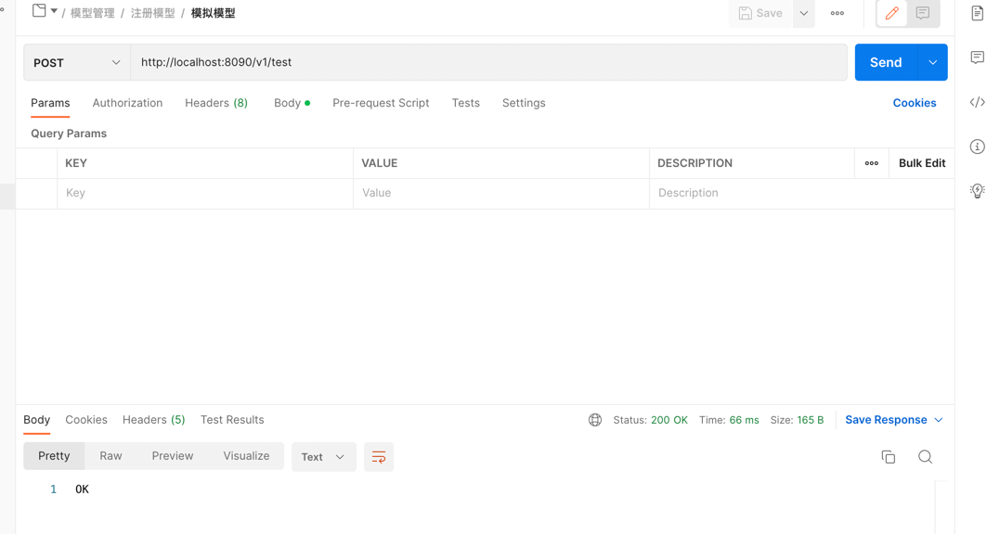

# mockserver
just for API mock

目的是想设计类似wireMock的功能实现，并提供两种模式：一种数据库，一种本地json文件持久化，
由于选型数据库的驱动用了mp,导致本地实现也需要依赖mp的包，不是一开始设想的，所以本地mock的暂不开发


## 数据库模式演示：

### 1.1注册模型到数据库
请求注册模型的接口
```shell
curl --location --request POST 'http://localhost:8090/v1/registerModel' \
--header 'Content-Type: application/json' \
--data-raw '{
    "path":"/v1/test",
    "http_method":"POST",
    "request_body":"{}",
    "response_status":200,
    "response_body":"OK"
}'

```

数据库查看


### 1.2查询所有模型

查询接口
```shell

curl --location --request GET 'http://localhost:8090//v1/getModels'
```


### 1.3进行实际mock测试
测试注册的模型
```shell
curl --location --request POST 'http://localhost:8090/v1/test' \
--header 'Content-Type: application/json' \
--data-raw '{
    "path":"/v1/test",
    "http_method":"POST",
    "request_body":"{}",
    "response_status":200,
    "response_body":"OK"
}'
```



### 1.4删除模型
删除模型接口
```shell
curl --location --request DELETE 'http://localhost:8090/v1/deleteModel' \
--header 'Content-Type: application/json' \
--data-raw '{
    "path":"/v1/test",
    "http_method":"POST",
    "request_body":"{}",
    "response_status":200,
    "response_body":"OK"
}'
```


